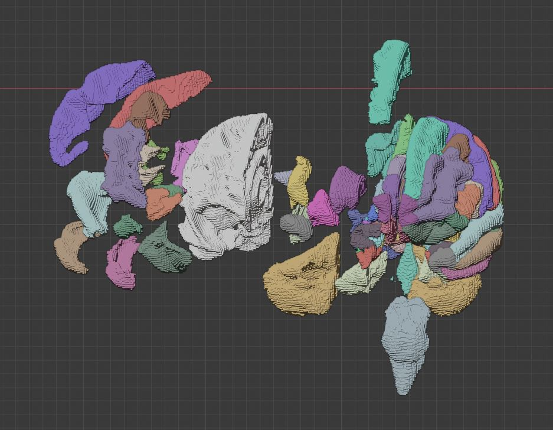

# BlenderBrainAtlas

BlenderBrainAtlas is a script to create 3D objects from a MRI segmentation file (usually preprocessed thanks to [Freesurfer](https://surfer.nmr.mgh.harvard.edu/)).
It generates a single 3D object (outer shell) for each brain's region of interest contained in the MRI file.

## Installation

In order to use `script.py` within blender, you need to install the [nibabel](https://nipy.org/nibabel/) library.

Installing new libraries in the python environment of [Blender](https://www.blender.org/) is not always easy. Here are some hints that may help you:

Make sure you are using the same version of python as you used for blender, to do this navigate to the folder where you installed blender. Under windows, this folder should be in a path similar to the following:
`C:\Program Files\Blender Foundation\Blender 2.82\2.82\python\bin`

The default python package manager PIP isn't provided with blender so we need to install it manually. Download the following script 
https://bootstrap.pypa.io/get-pip.py and save it wherever you want (right click -> save as -> get_pip.py). Then run this script with blender's python:
In my case, the command line looks like this:
`C:\Program Files\Blender Foundation\Blender 2.82\2.82\python\bin>python.exe C:\Users\Victor\Desktop\get-pip.py`

You can upgrade pip using the --upgrade pip option:
`C:\Program Files\Blender Foundation\Blender 2.82\2.82\python\bin>python.exe -m pip install --user --upgrade pip`

Finally you can install the desired libraries ( in our case nibabel) using pip:
`C:\Program Files\Blender Foundation\Blender 2.82\2.82\python\bin>python.exe -m pip install nibabel`

## Usage
To use the script, open a new python project, open a new text editor panel, click "open" and select `script.py`.
I can take a while depending on your specs. You may want to open blender console (window -> toggle system console) before running the script in order to check that it is working properly.

If you want to use another segmentation make sure you change the `mri` variable to the path of the desire segmentation file.
Also make sure to use the corresponding look up table by changing the `lut` variable.

## How it works
The script starts by opening the MRI file (segmentation) using nibabel. It then opens the LUT File in which the name and colors of each region is indicated.
Then script iterates for each region in the MRI and proceeds as follows:
    - For each voxel, it defines the face to be displayed, depending on the presence or not of adjacent voxels belonging to the same region.
    - It then draws all the selected faces.
    - It then assembles the faces to each others.

## Exemple
The provided `BrainAtlas.blend` file contained the already generated 3D visualization of the `aparc+aseg.mgz` segmentation of fsaverage subject provided along with the [Freesurfer](https://surfer.nmr.mgh.harvard.edu/) software.

You can easily export meshes to STL files using blender. Some can preview some example [here](https://github.com/vferat/BlenderBrainAtlas/blob/main/BlenderBrainAtlas/STL):
- [Left-Cerebellum-Cortex.stl](https://github.com/vferat/BlenderBrainAtlas/blob/main/BlenderBrainAtlas/STL/Left-Cerebellum-Cortex.stl)
- [Left-Hippocampus.stl](https://github.com/vferat/BlenderBrainAtlas/blob/main/BlenderBrainAtlas/STL/Left-Hippocampus.stl)
- [lower_brain.stl](https://github.com/vferat/BlenderBrainAtlas/blob/main/BlenderBrainAtlas/STL/lower_brain.stl)

